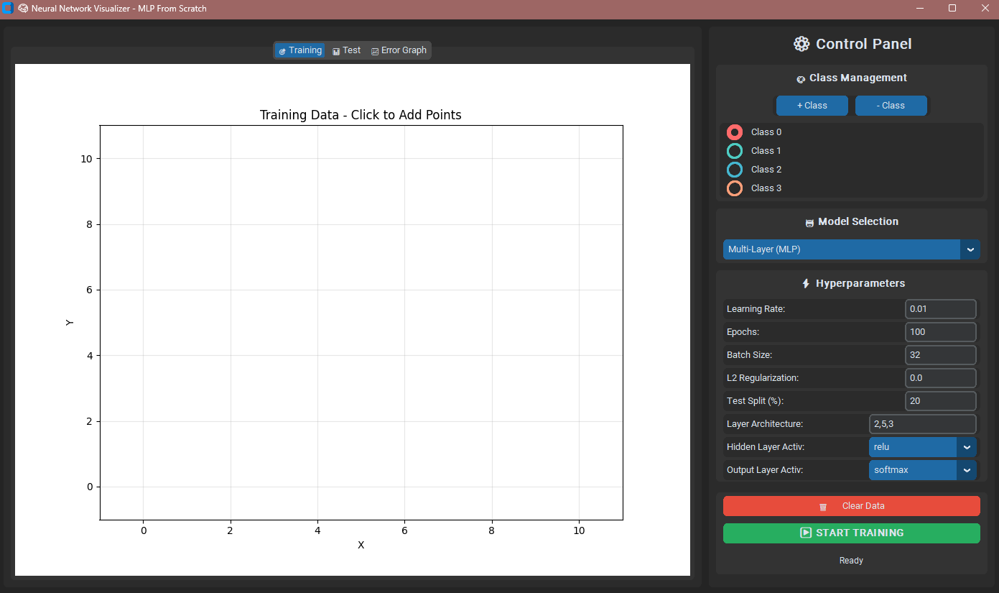

# 🧠 Neural Network Visualizer - MLP From Scratch

**Profesyonel, interaktif sinir ağı görselleştirme uygulaması**

Python ve NumPy kullanılarak sıfırdan yazılmış tek katmanlı ve çok katmanlı sinir ağı algoritmalarını görselleştiren modern masaüstü uygulaması.



**⚠️ Eğitim Amaçlı Proje**: Hiçbir ML kütüphanesi kullanılmadı (scikit-learn, TensorFlow, PyTorch, Keras). Tüm algoritmalar sıfırdan NumPy ile yazılmıştır.


## 📋 İçindekiler

- [Özellikler](#-özellikler)
- [Kurulum](#-kurulum)
- [Kullanım](#-kullanım)
- [Veri Akış Şeması](#-veri-akış-şeması)
- [Proje Yapısı](#-proje-yapısı)
- [Algoritmalar](#-algoritmalar)
- [Katkıda Bulunma](#-katkıda-bulunma)

## ✨ Özellikler

### 🎯 İnteraktif Veri Ekleme
- Fare ile doğrudan grafik üzerine tıklayarak veri noktaları ekleyin
- Çoklu sınıf desteği (maksimum 6 sınıf)
- Dinamik sınıf yönetimi

### 🤖 Üç Farklı Algoritma
1. **Single-Layer Perceptron**: Doğrusal olarak ayrılabilir problemler için
2. **Single-Layer Delta Rule (Adaline)**: MSE minimize eden Widrow-Hoff öğrenme kuralı
3. **Multi-Layer Perceptron (MLP)**: Backpropagation ile eğitilen derin sinir ağı

### 🎨 Canlı Görselleştirme
- **Training Sekmesi**: Eğitim sırasında karar sınırlarının canlı animasyonu
- **Test Sekmesi**: Test verisi üzerinde model performansı
- **Error Graph**: Epoch'lara göre error değişimi

### ⚙️ Esnek Hiperparametre Kontrolü
- Özelleştirilebilir katman mimarisi
- Aktivasyon fonksiyonu seçimi (ReLU, Tanh, Sigmoid, Softmax)
- Öğrenme oranı, epoch sayısı, batch size ayarları
- L2 Regularization desteği
- Test/Train split oranı

### 🔬 Sıfırdan Yazılmış Algoritmalar
- **Backpropagation**: Chain rule ile manuel gradyan hesaplama
- **Aktivasyon Fonksiyonları**: ReLU, Tanh, Sigmoid ve türevleri
- **Loss Fonksiyonu**: Cross-Entropy Loss
- **Optimization**: Mini-batch Gradient Descent
- **Regularization**: L2 (Weight Decay)

## 🚀 Kurulum

### Gereksinimler
- Python 3.8 veya üzeri
- pip paket yöneticisi

### Adım 1: Depoyu Klonlayın
```bash
git clone https://github.com/ensaryesir/MLP-From-Scratch-GUI.git
cd MLP-From-Scratch-GUI
```

### Adım 2: Bağımlılıkları Yükleyin
```bash
pip install -r requirements.txt
```

### Adım 3: Uygulamayı Çalıştırın
```bash
python main.py
```

## 📖 Kullanım

### 🎯 Temel Adımlar
1. **Veri Ekleme**: Training sekmesinde grafiğe tıklayarak veri noktaları ekleyin
2. **Model Seçimi**: Perceptron, Delta Rule veya MLP seçin
3. **Hiperparametre Ayarları**: Learning rate, epochs, architecture ayarlayın
4. **Eğitim**: START TRAINING butonuna tıklayın
5. **İzleme**: Error Graph'te loss değişimini, Training'de karar sınırlarını takip edin
6. **Değerlendirme**: Test sekmesinde model performansını görün

### 💡 İpuçları
- **Veri**: Sınıflar arası dengeli nokta sayısı, farklı bölgelere dağıtım
- **Model**: Basit problemler → Perceptron/Delta Rule, Non-linear → MLP
- **Eğitim**: Error azalmıyor → Learning rate artır, Error sallanıyor → Learning rate düşür

### 🔧 Örnek Senaryolar

#### Senaryo 1: XOR Problemi
```
1. İki sınıf oluşturun
2. Veri: (2,2)→Class0, (8,8)→Class0, (2,8)→Class1, (8,2)→Class1
3. Model: Multi-Layer (MLP)
4. Mimari: 2,8,2
5. Aktivasyon: relu,softmax
6. Öğrenme Oranı: 0.1
7. Epochs: 300
```

#### Senaryo 2: 3 Sınıflı Classification
```
1. Üç sınıf oluşturun
2. Her sınıftan 15-20 nokta ekleyin
3. Model: Multi-Layer (MLP)
4. Mimari: 2,10,3
5. Aktivasyon: tanh,softmax
6. Öğrenme Oranı: 0.05
7. Epochs: 200
```

## 🔄 Veri Akış Şeması

### 📊 Detaylı Veri Akış Tablosu
```
👤Kullanıcı → 🎛️ Kontrol Paneli → 🧠 main.py → 🤖 Algoritmalar → 🧠 main.py → 📊 Görselleştirme
      ↓                 ↓                ↓               ↓              ↓                 ↓
  Mouse Click      Hyperparams       Orchestrate     Training        Receive         Real-time
  Add Points       Learning Rate     Create Model    Forward Pass    Results         Error Graph
  Select Class     Epochs            Start Train     Backward Pass   Coordinate      Decision Boundary
  Class Mgmt       Architecture      Async Loop      Update Weights  Update UI       Test Results
  Buttons          Activations       Coordinate      Yield Results   Distribute      Live Animation
  Clear Data       Batch Size        Get Settings    Compute Loss    Send Data       Tab Switching
  Training         L2 Lambda         Build Model     Fit Data        Control         Status Updates
  Settings         Test Split        Run Epochs      Generate        Manage          Plot Updates
``` 

### 🔗 Bağlantı Mekanizmaları

**1. Callback Pattern (Control Panel → Main):**
- Button click → callback trigger → main.py method çağrısı

**2. Parameter Passing (Main → Algorithm):**
- Hyperparameter'ları topla → model constructor'a geçir

**3. Generator Pattern (Algorithm → Main):**
- Her epoch'ta yield → non-blocking execution → UI responsive

**4. Direct Calls (Main → Visualization):**
- Sonuçları al → görselleştirme method'larını çağır

**Bu mimari sayesinde:**
- ✅ **Modüler**: Her component bağımsız
- ✅ **Responsive**: Non-blocking UI  
- ✅ **Extensible**: Yeni algoritmalar kolayca eklenebilir
- ✅ **Maintainable**: Clear separation of concerns

## 📁 Proje Yapısı

```
MLP-From-Scratch-GUI/
├── main.py                      # Ana uygulama orkestratörü
├── requirements.txt             # Python bağımlılıkları
├── README.md                    # Proje dokümantasyonu
│
├── algorithms/                  # Sinir ağı algoritmaları
│   ├── __init__.py
│   ├── single_layer.py         # Perceptron ve Delta Rule
│   └── mlp.py                  # Multi-Layer Perceptron + Backpropagation
│
├── gui/                         # Kullanıcı arayüzü bileşenleri
│   ├── __init__.py
│   ├── control_panel.py        # Kontrol paneli widget'ları
│   └── visualization_frames.py # Görselleştirme sekmeleri
│
└── utils/                       # Yardımcı modüller
    ├── __init__.py
    └── data_handler.py         # Veri yönetimi
```

### 📈 Test Senaryoları

**Senaryo 1: Linear Problem (Başarılı ✓)**
- 2 sınıf, doğrusal ayrılabilir
- Perceptron ile hızlı yakınsama
- Accuracy: ~100%

**Senaryo 2: XOR Problemi (Başarılı ✓)**
- 2 sınıf, non-linear
- MLP (2,8,2) ile çözüm
- Accuracy: ~95-100%

**Senaryo 3: Multi-Class (Başarılı ✓)**
- 3-6 sınıf
- MLP ile kompleks karar sınırları
- Accuracy: Model ve veriye bağlı

## 🧮 Algoritmalar

### Perceptron
```
Güncelleme Kuralı: w = w + η * (y_true - y_pred) * x
```
- Step aktivasyon fonksiyonu
- Binary ve multi-class classification desteği

### Delta Rule (Adaline)
```
Loss: MSE = (1/n) * Σ(y_true - y_pred)²
Gradient: ∂L/∂w = -(2/n) * X^T * (y_true - y_pred)
```
- Linear aktivasyon fonksiyonu
- Gradient descent ile eğitim

### Multi-Layer Perceptron (MLP)

**Forward Propagation:**
```
Z^[l] = A^[l-1] * W^[l] + b^[l]
A^[l] = activation(Z^[l])
```

**Backpropagation:**
```
dZ^[L] = A^[L] - Y  (son katman)
dW^[l] = (1/m) * A^[l-1]^T * dZ^[l]
db^[l] = (1/m) * Σ(dZ^[l])
dZ^[l-1] = dZ^[l] * W^[l]^T ⊙ g'(Z^[l-1])
```

**Aktivasyon Fonksiyonları:**
- **ReLU**: `f(x) = max(0, x)`, `f'(x) = 1 if x > 0 else 0`
- **Tanh**: `f(x) = tanh(x)`, `f'(x) = 1 - tanh²(x)`
- **Sigmoid**: `f(x) = 1/(1+e^-x)`, `f'(x) = f(x)(1-f(x))`
- **Softmax**: `f(x_i) = e^x_i / Σe^x_j` (multi-class için)

**Loss Fonksiyonu:**
```
Cross-Entropy: L = -(1/m) * Σ Σ y_true * log(y_pred)
L2 Regularization: L_reg = (λ/2m) * Σ||W||²
```

## 🤝 Katkıda Bulunma

Katkılarınızı bekliyorum! Lütfen şu adımları izleyin:

1. Projeyi fork edin
2. Feature branch oluşturun (`git checkout -b feature/AmazingFeature`)
3. Değişikliklerinizi commit edin (`git commit -m 'Add some AmazingFeature'`)
4. Branch'inizi push edin (`git push origin feature/AmazingFeature`)
5. Pull Request açın

## 📝 Lisans

Bu proje MIT lisansı altında lisanslanmıştır. Detaylar için `LICENSE` dosyasına bakın.

## 👨‍💻 Geliştirici

**Ensar Yesir**
- GitHub: [@ensaryesir](https://github.com/ensaryesir)

⭐ Projeyi beğendiyseniz yıldız vermeyi unutmayın!

**Keyifli kodlamalar! 🚀**